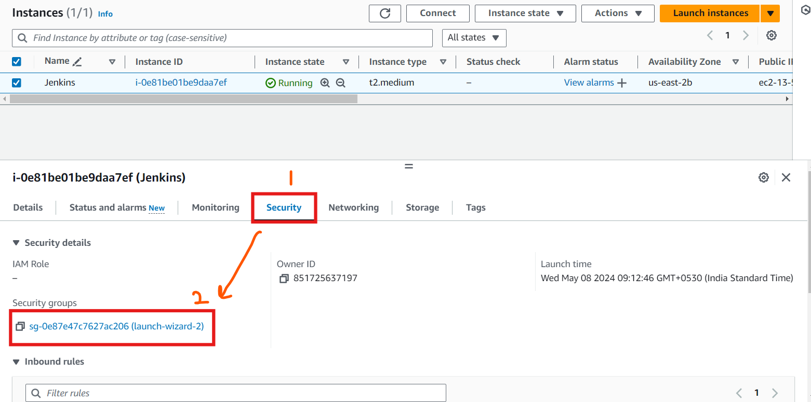
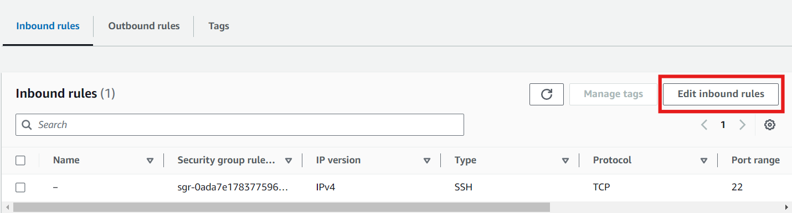
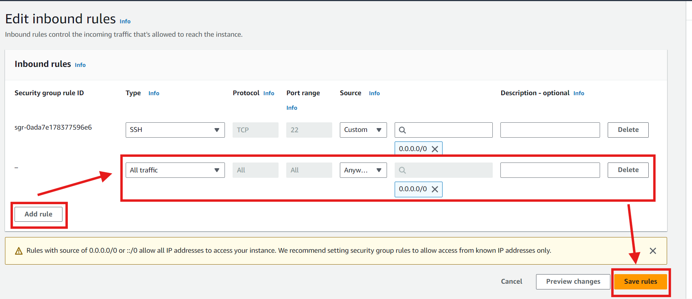

### Jenkins Project 1

This is a simple project to test the Jenkins pipeline using AWS.

Tools used : 
- Jenkins
- SonarQube
- Maven
- Docker
- Trivy

Step 1: Create a new ubuntu instance in East-US region, with 30gb and t2.medium as configuration.
connect to instance, and sign-in as root user using command "sudo su".

Step 2: Install Jenkins by taking the command from my git repo:
repo link : https://github.com/saurabh-kumar-coder/Tools-installation-commands/blob/main/jenkins.sh

Step 3: change security group of the instance: \n
  adding security group:

  edit inbound rule : 

  adding inbound rule:

