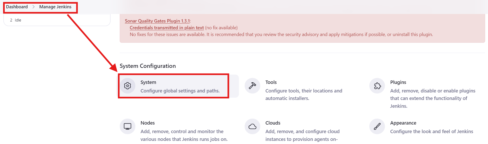
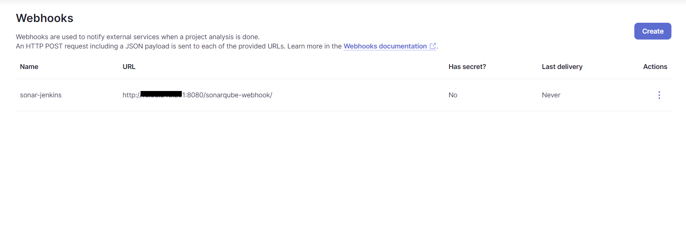

### Jenkins Project 1

This is a simple project to test the Jenkins pipeline using AWS.

Tools used :

- Jenkins
- SonarQube
- Maven
- Docker
- Trivy

Step 1: Create a new ubuntu instance in East-US region, with 30gb and t2.medium as configuration.
connect to instance, and sign-in as root user using command "sudo su".

Step 2: Install Jenkins by taking the command from my git repo:  
repo link : https://github.com/saurabh-kumar-coder/Tools-installation-commands/blob/main/jenkins.sh

Step 3: change security group of the instance:  
adding security group:

edit inbound rule :

adding inbound rule:

Step 3: Open the jenkins from EC2 IP Address  

- <IP_Address>:8080
- Get Administrator password using command "cat /var/lib/jenkins/secrets/initialAdminPassword"
  
- install plugins
  
- create user
  
   
   
  

- Click on New Item
  

- create new Pipeline
  

- configure the pipeline
  
   
  

Step 4: Adding plugins for sonar and jfrog

<!--  -->

list of plugins:

- sonar gerrit
- sonarqube scanner
- sonarqube generic coverage
- sonar quality gates
- quality gates
- artifactory
- jfrog
